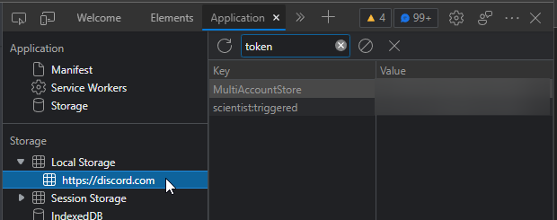
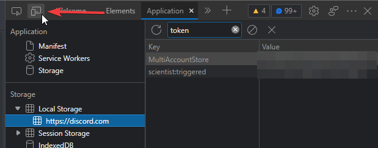
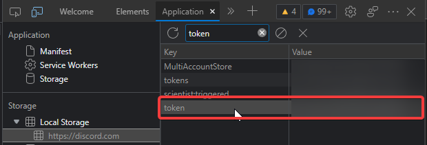

## Finding Discord User Token
First, You have to use F12 on any browser that support local storage.  
Then, click to Application, search for token.  
  
Next, click on the "Toggle device emulation", click on Local Storage then click back "discord".  
  
The token will appear.  

